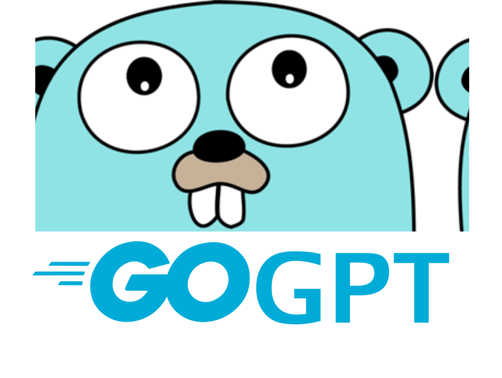

# GoGPT

<div align="center">
  
</div>

A simple command-line chatbot written in Go that can greet users, tell the time, and share jokes.

## Features

- **Interactive Chat Interface**: Engage with the bot using either numbered commands or natural language
- **Multiple Response Types**:
  - Greeting and self-introduction
  - Current time and date display
  - Random joke telling
- **Natural Language Processing**: Understands some keywords and phrases in addition to numbered commands
- **Persistent Session**: Remembers your name throughout the conversation

## Installation

### Prerequisites

- Go 1.16 or higher installed on your system
- Terminal/Command prompt access

### Setup

1. Clone or download the project to your local machine
2. Navigate to the project directory:
   ```bash
   cd GoGPT
   ```
3. Build the application:
   ```bash
   go build -o GoGPT
   ```

## Usage

### Running the Chatbot

1. Start the chatbot:
   ```bash
   ./GoGPT
   ```
2. Enter your name when prompted
3. Choose from the available options

### Available Commands

The chatbot supports both numbered commands and natural language input:

#### Option 1: Greeting/Introduction

- **Number command**: Type `1`
- **Natural language**: Say "hello", "hi", "introduce yourself", "who are you", etc.
- **Response**: The bot will introduce itself and greet you by name

#### Option 2: Time and Date

- **Number command**: Type `2`
- **Natural language**: Ask "what time is it?", "time", "clock", "hour", "now", etc.
- **Response**: Current time (HH:MM:SS format) and today's date

#### Option 3: Tell a Joke

- **Number command**: Type `3`
- **Natural language**: Say "tell me a joke", "joke", "funny", "humor", "make me laugh", etc.
- **Response**: A random joke from the bot's collection

#### Exit

- **Command**: Type `0`
- **Action**: Exits the chatbot

### Example Conversation

```
Welcome to GoGPT! Please enter your name:
Alice
Hello, Alice!

What would you like me to do?
You can type numbers (1, 2, 3) or use natural language:
- 1 or 'hello' / 'introduce yourself'
- 2 or 'what time is it?'
- 3 or 'tell me a joke'
- 0 to exit

hello
Hello Alice, I am GoGPT!

What would you like me to do?
...

what time is it?
The time right now is 14:30:25 and the day is 14th of July

What would you like me to do?
...

tell me a joke
Why don't scientists trust atoms? Because they make up everything!

What would you like me to do?
...

0
Exiting GoGPT!
```

## Project Structure

```
GoGPT/
├── main.go                 # Main application entry point
├── go.mod                  # Go module file
├── README.md              # This file
├── chatbot/
│   ├── chatbot.go         # Core chatbot logic
│   └── responses.go       # Response generation functions
├── handlers/
│   └── input.go           # Input processing and keyword matching
└── data/
    └── jokes.txt          # Collection of jokes (comma-separated)
```

## Customization

### Adding New Jokes

Edit the `data/jokes.txt` file and add new jokes separated by commas:

```
Your new joke here,Another joke,And another one...
```

### Extending Functionality

To add new commands:

1. Add new response function in `chatbot/responses.go`
2. Add new case in `ProcessMsg` function in `chatbot/chatbot.go`
3. Define keywords for natural language processing
4. Update the help text in `main.go`

## Dependencies

This project uses only Go standard library packages:

- `bufio` - For reading user input
- `fmt` - For formatted I/O
- `os` - For file operations and system interaction
- `strings` - For string manipulation
- `time` - For time-related operations
- `math/rand` - For random number generation
- `regexp` - For regular expression operations

## Contributing

Feel free to fork this project and submit pull requests for improvements or bug fixes.

## License

This project is open source and available under the MIT License.
